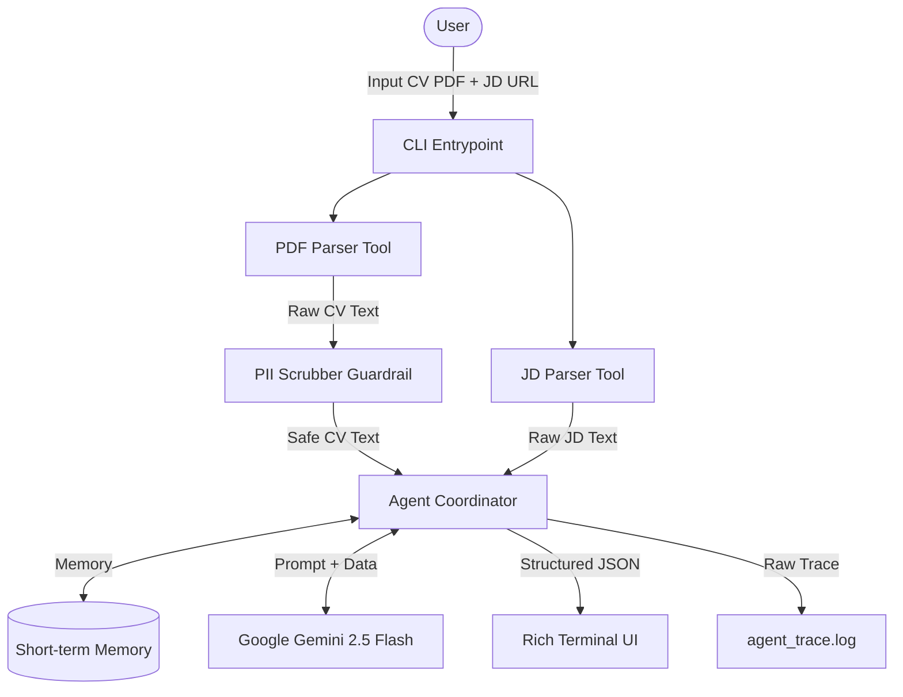

# Career Copilot v0

A personal AI career assistant that reads Job Descriptions (JDs) and tailored CVs to provide fit evaluation and improvement suggestions. This is the v0 implementation for the Kaggle 5-Day AI Agents capstone.

## 🌟 Features (5 Core Concepts)
1. **Agent Architecture**: Chain-of-Thought reasoning with structured JSON outputs.
2. **Evaluation**: LLM-as-a-Judge validation script (`src/evaluate.py`).
3. **Guardrails**: PII (Personally Identifiable Information) removal before LLM processing (`src/guardrails/pii_scrubber.py`).
4. **Memory**: Short-term conversational memory within the CLI session.
5. **Tools**: PDF CV parser and web JD parser.

## 🏗️ Architecture



## 🚀 Setup & Run
1. Clone the repository.
2. `pip install -r requirements.txt`
3. Copy `.env.example` to `.env` and fill in `GEMINI_API_KEY`.
4. Run the main CLI:
   ```bash
   python src/main.py
   ```

## 🧪 Evaluation (LLM-as-a-Judge)
Run the automated evaluation suite:
```bash
python src/evaluate.py
```

## 📺 Demo Video
[Link to YouTube Demo] <!-- Replace before Kaggle Submission -->

## 👁️ Observability
- **UX**: Clean spinners and colored outputs.
- **Trace Logs**: All raw JSONs and CoT steps are fully logged in `logs/agent_trace_*.log`.
